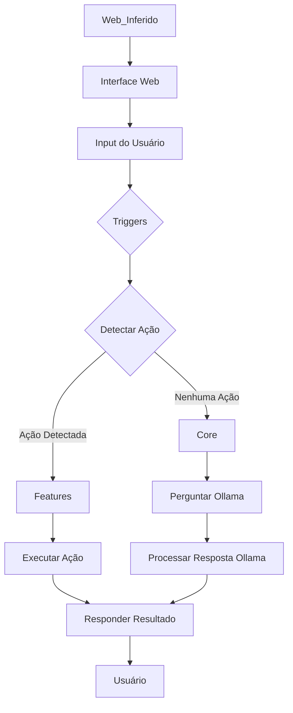

# Jarvis: Assistente Pessoal Baseado em Texto

## Introdução
Este documento detalha a arquitetura, as tecnologias empregadas e as funcionalidades do sistema Jarvis, um assistente pessoal baseado em texto. O objetivo é fornecer uma compreensão aprofundada do sistema, servindo como manual e base para futuras melhorias.

## Visão Geral do Sistema
O Jarvis é um assistente pessoal baseado em texto com capacidades de interação com o usuário, detecção de ações por meio de gatilhos e um fallback para um modelo de linguagem grande (LLM), especificamente o Ollama. A estrutura do projeto sugere uma modularidade clara entre as funcionalidades principais (`core`), as características específicas (`features`) e os mecanismos de interação (`triggers`).

## Arquitetura do Sistema
A arquitetura do Jarvis é dividida em módulos principais, cada um com responsabilidades bem definidas:

*   **Módulo Principal (`main.py`):** Orquestra o fluxo de execução, desde a inicialização até a interação contínua com o usuário. Gerencia a animação de início, o carregamento de gatilhos, a detecção e execução de ações, e a interação com o Ollama.
*   **Módulo `core`:** Contém as funcionalidades essenciais e de baixo nível do sistema, como a interação com o Ollama, o parsing de respostas e o gerenciamento de processamento (`thinking`).
*   **Módulo `features`:** Abriga as funcionalidades específicas que o Jarvis pode executar, como verificar a hora, monitoramento e execução de scripts.
*   **Módulo `triggers`:** Define os gatilhos (palavras-chave ou frases) que ativam as ações correspondentes nas `features`.
*   **Módulo `web` (Inferido):** A presença de `jarvis/web/app.py`, `jarvis/web/static/css/style.css`, `jarvis/web/static/js/script.js` e `jarvis/web/templates/index.html` sugere uma interface web para o Jarvis, embora o `main.py` não a utilize diretamente no fluxo principal de console.

### Diagrama de Alto Nível (Conceitual)


## Tecnologias e Bibliotecas Utilizadas
O sistema Jarvis é construído principalmente em Python e faz uso de diversas bibliotecas padrão e de terceiros para suas funcionalidades.

### Python
Como linguagem de programação principal, o Python oferece a flexibilidade e a vasta gama de bibliotecas que permitem a construção de um sistema como o Jarvis.

### Bibliotecas Padrão do Python
*   `subprocess`: Utilizada para executar comandos externos do sistema operacional, como exibir uma animação ASCII via `curl ascii.live/earth`.
*   `time`: Usada para controlar o tempo de execução e introduzir pausas.
*   `os`: Essencial para interagir com o sistema operacional, como manipular caminhos de arquivos e listar diretórios, crucial para carregar gatilhos.
*   `json`: Utilizada para serializar e desserializar dados no formato JSON, fundamental para carregar os gatilhos.

### Módulos Internos (Inferidos/Identificados)
*   `core.ollama`: Responsável pela interação com o modelo de linguagem Ollama, gerenciando a inicialização e o envio de consultas.
*   `core.parser`: Encarregado de processar e extrair informações relevantes das respostas brutas recebidas do Ollama.
*   `core.thinking`: Mecanismo para simular ou gerenciar um estado de processamento ou "pensamento" do Jarvis.
*   `features.hora`: Contém a lógica para a funcionalidade de verificar a hora do sistema.
*   `features.monitoramento`: Provavelmente lida com funcionalidades de monitoramento.
*   `features.scripts`: Responsável pela execução de scripts definidos pelo usuário ou pelo sistema.
*   `triggers.hora.json`: Arquivo JSON que define os gatilhos para a funcionalidade de verificar a hora.
*   `triggers.scripts.json`: Arquivo JSON que define os gatilhos para a funcionalidade de execução de scripts.
*   `web.app.py`: Sugere a existência de uma aplicação web, possivelmente usando um framework como Flask ou FastAPI.
*   `web.static/css/style.css`, `web.static/js/script.js`, `web.templates/index.html`: Indicam a presença de ativos estáticos (CSS, JavaScript) e templates HTML para a interface web.

### Ferramentas Externas
*   **Ollama:** Um framework para executar modelos de linguagem grandes (LLMs) localmente. O Jarvis o utiliza para processar consultas do usuário que não são capturadas pelos gatilhos predefinidos, permitindo uma capacidade de resposta mais flexível e abrangente.
*   **`curl ascii.live/earth`:** Utilizado na inicialização para exibir uma animação ASCII de um globo terrestre, adicionando um toque visual.

## Funcionalidades Detalhadas

1.  **Inicialização e Animação:** Ao iniciar, o Jarvis executa uma animação visual no terminal usando `curl` para exibir um globo terrestre em ASCII, proporcionando uma experiência de usuário inicial mais envolvente.
2.  **Carregamento de Gatilhos (Triggers):** O sistema carrega dinamicamente gatilhos de arquivos JSON localizados no diretório `triggers`. Cada arquivo JSON define uma ação e uma lista de frases ou palavras-chave que, quando detectadas na entrada do usuário, ativam essa ação. Isso permite uma fácil expansão e personalização das funcionalidades.
3.  **Detecção e Execução de Ações:** Após receber a entrada do usuário, o Jarvis primeiro tenta detectar uma ação predefinida comparando a entrada com os gatilhos carregados. Se um gatilho for correspondido, a ação associada é executada por meio da função `executar_acao()`, que direciona para a função correspondente no módulo `features`.
4.  **Fallback para Inteligência Artificial (Ollama):** Se nenhuma ação predefinida for detectada, a entrada do usuário é enviada ao Ollama para processamento. Isso permite que o Jarvis responda a uma ampla gama de perguntas e comandos que não estão explicitamente programados como gatilhos. A resposta do Ollama é então processada pelo módulo `core.parser` antes de ser apresentada ao usuário.
5.  **Resposta ao Usuário:** O Jarvis formula suas respostas com base no resultado da execução de uma `feature` ou na resposta processada do Ollama, garantindo uma comunicação clara e contextualizada.

## Estrutura de Diretórios (Inferida)
```
jarvis/
├── core/
│   ├── __init__.py
│   ├── config.py
│   ├── interpreter.py
│   ├── logger.py
│   ├── ollama.py
│   ├── parser.py
│   ├── scheduler.py
│   └── thinking.py
├── features/
│   ├── __init__.py
│   ├── hora.py
│   ├── monitoramento.py
│   └── scripts.py
├── triggers/
│   ├── hora.json
│   └── scripts.json
├── web/
│   ├── app.py
│   ├── static/
│   │     ├── ascii/
│   │     │   └── earth_frames.json
│   │     ├── css/
│   │     │   └── style.css
│   │     └── js/
│   │         └── script.js
│   └── templates/
│         └── index.html
├── main.py
├── logs/ (inferido)
├── prompts/ (inferido)
├── scripts/ (inferido)
└── voice/ (inferido)
```

## Opinião Técnica e Sugestões para Versões Futuras
O sistema Jarvis apresenta uma base sólida para um assistente pessoal, com uma arquitetura modular que facilita a adição de novas funcionalidades. A integração com o Ollama é um ponto forte, permitindo capacidades de IA flexíveis e a execução local de LLMs.

### Pontos Fortes
*   **Modularidade:** A separação em `core`, `features` e `triggers` promove a organização do código e a facilidade de manutenção e expansão.
*   **Extensibilidade via Triggers:** O sistema de gatilhos baseado em JSON é uma forma eficaz de adicionar novas ações sem alterar a lógica central.
*   **Integração com Ollama:** A capacidade de usar LLMs localmente é uma vantagem significativa para privacidade e personalização.
*   **Interatividade:** A animação de início e o gerenciamento de estado de “pensamento” melhoram a experiência do usuário.

### Áreas para Melhoria e Sugestões
1.  **Tratamento de Erros e Robustez:** Expandir o tratamento de erros para incluir logging mais detalhado e mecanismos de recuperação de falhas. Validação de esquema JSON mais rigorosa para o carregamento de gatilhos.
2.  **Gerenciamento de Dependências:** Implementar um arquivo `requirements.txt` ou `pyproject.toml` para gerenciar as dependências do projeto e garantir a reprodutibilidade do ambiente.
3.  **Interface de Usuário (Web/GUI):** Desenvolver e integrar completamente a interface web (usando Flask ou FastAPI) para uma experiência de usuário mais rica e acessível, incluindo histórico de conversas, configurações personalizadas e visualização de dados de monitoramento.
4.  **Processamento de Linguagem Natural (PLN) Avançado:** Aprimorar a detecção de ações com técnicas de PLN mais avançadas (tokenização, stemming, lematização, reconhecimento de intenção) usando bibliotecas como NLTK ou spaCy.
5.  **Gerenciamento de Estado e Contexto:** Implementar um gerenciamento de estado e contexto para permitir conversas mais fluidas e complexas, onde o Jarvis se lembraria de interações anteriores (usando bancos de dados simples ou mecanismos de cache).
6.  **Expansão de Features:** Desenvolver as `features` de monitoramento e scripts em profundidade, incluindo integração com APIs de sistema ou serviços externos e um mecanismo seguro para execução de scripts.
7.  **Testes Automatizados:** Implementar testes unitários e de integração para garantir a correção das funcionalidades e prevenir regressões.
8.  **Documentação de Código:** Adicionar `docstrings` e comentários detalhados ao código-fonte para facilitar a compreensão e a colaboração.
9.  **Configuração Externa:** Mover configurações sensíveis ou variáveis de ambiente para um arquivo de configuração externo (`.env`, `config.ini`).
10. **Segurança:** Implementar validação de entrada, sanitização e execução de scripts em ambientes isolados (sandboxing) se o sistema for exposto via web ou executar scripts externos.

## Conclusão
O Jarvis é um projeto promissor com uma arquitetura bem pensada para um assistente pessoal. Com as melhorias sugeridas, ele tem o potencial de se tornar uma ferramenta ainda mais poderosa e amigável, capaz de interagir de forma mais inteligente e robusta com seus usuários. A capacidade de integrar LLMs localmente é um diferencial que, se bem explorado, pode levar a um assistente altamente personalizado e eficiente.
